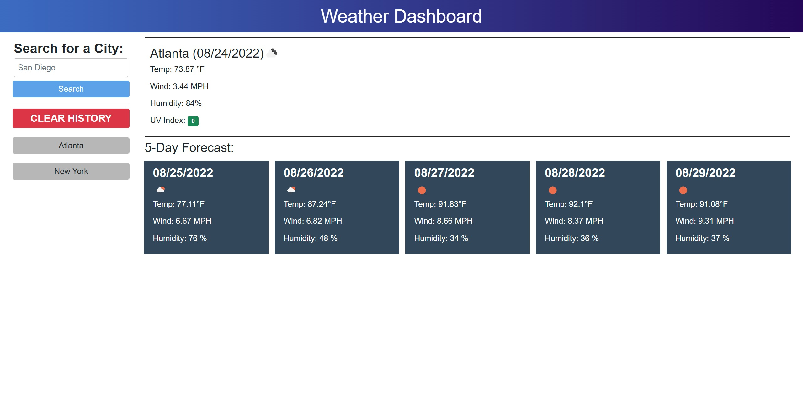

# Weather Dashboard Challenge

## Contents
This is Adrian Jimenez's module 6 weather dashboard challenge submission.

I started this project by styling and constructing the HTML / CSS of the page as I saw fit to match the mockup. I created prototype elements with classes to apply later in my javascript so I knew how everything would look like. Then I began creating my javascript fetch calls to call open weather api for the data I needed to display. Afterwards, I created my constructor functions and functions to apply said data onto the elements already on the page. I was able to create the entire forecast through a couple of loops allowing me to avoid having to manually make the forecast and giving each element individual IDs (the loops did it for me). With this, I was also able to apply the data to the text content of these elements as I constructed them, allowing me to easily display them onto the page with the appropriate data. Once I completed this, I made my search bar functional, allowing me to search for cities I wanted and calling my constructor functions to update the city data on the page. Finally I created the save and load functions to save the user's most recent history as buttons onto the page. I added logic to limit the length of said history to 8 elements, and make sure to not add duplicate searches into the history array. 

## Built With
* HTML
* CSS
* JavaScript
* Bootstrap
* Moment.js
* Open Weather API

## Preview

## Website
https://puppetaj.github.io/06-Dashboard-AJ/

## Credits
Made by Adrian Jimenez

## License

MIT License

Copyright ©️ 2022 Adrian Jimenez

Permission is hereby granted, free of charge, to any person obtaining a copy
of this software and associated documentation files (the "Software"), to deal
in the Software without restriction, including without limitation the rights
to use, copy, modify, merge, publish, distribute, sublicense, and/or sell
copies of the Software, and to permit persons to whom the Software is
furnished to do so, subject to the following conditions:

The above copyright notice and this permission notice shall be included in all
copies or substantial portions of the Software.

THE SOFTWARE IS PROVIDED "AS IS", WITHOUT WARRANTY OF ANY KIND, EXPRESS OR
IMPLIED, INCLUDING BUT NOT LIMITED TO THE WARRANTIES OF MERCHANTABILITY,
FITNESS FOR A PARTICULAR PURPOSE AND NONINFRINGEMENT. IN NO EVENT SHALL THE
AUTHORS OR COPYRIGHT HOLDERS BE LIABLE FOR ANY CLAIM, DAMAGES OR OTHER
LIABILITY, WHETHER IN AN ACTION OF CONTRACT, TORT OR OTHERWISE, ARISING FROM,
OUT OF OR IN CONNECTION WITH THE SOFTWARE OR THE USE OR OTHER DEALINGS IN THE
SOFTWARE.
